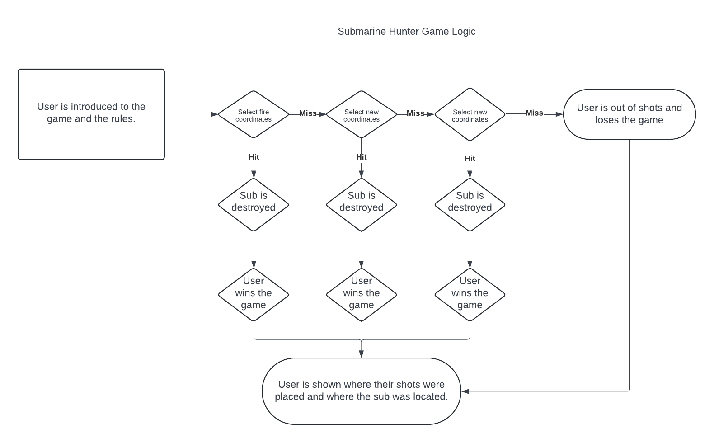
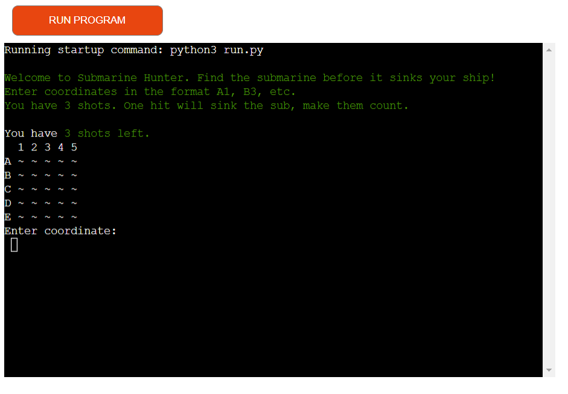
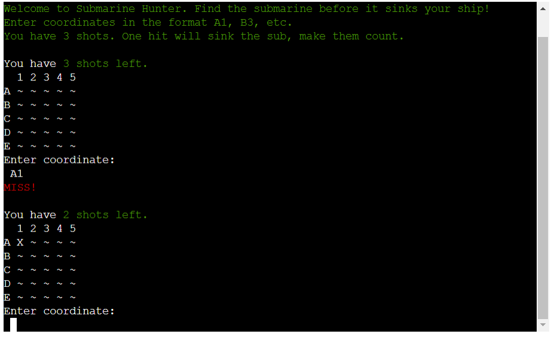
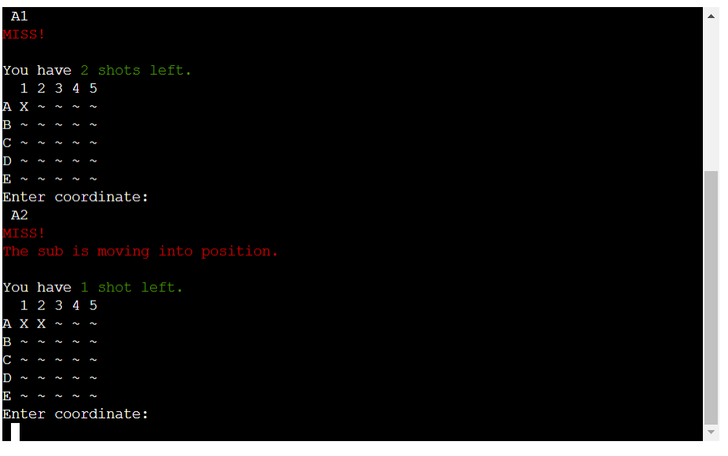
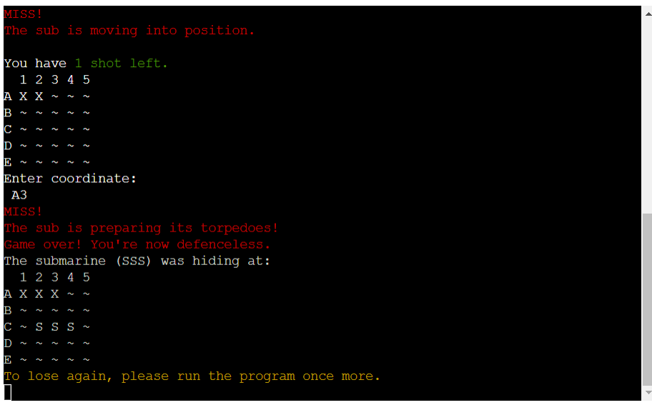
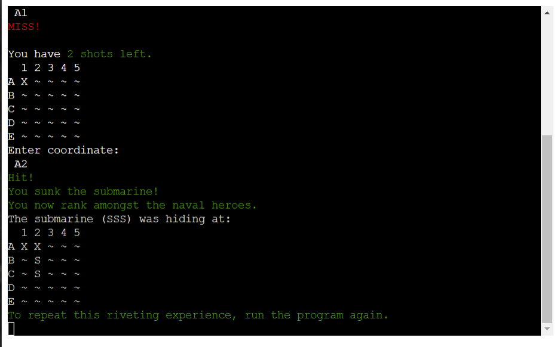
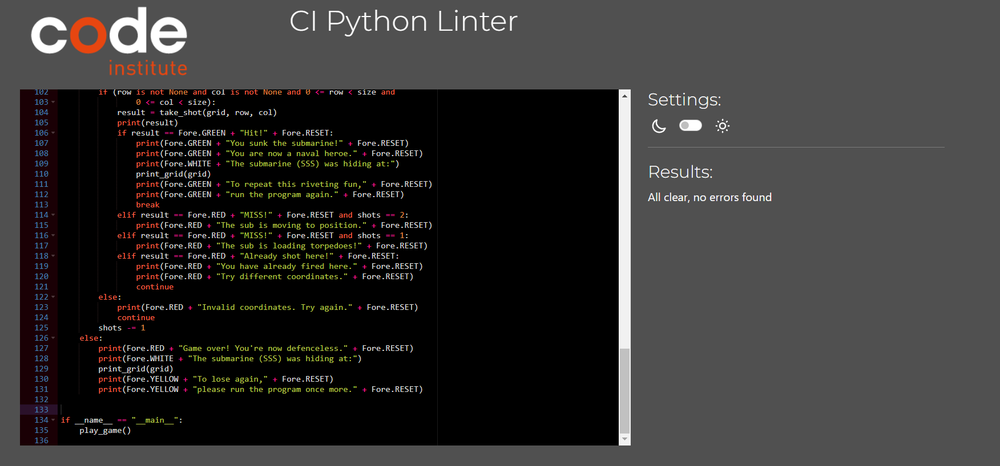

# Submarine Hunter

Submarine Hunter is a command-line game where players take on the challenge of finding and sinking a hidden submarine on a grid. With limited shots and a randomized submarine location, the game tests your logic, strategy, and a bit of luck.

## Live Demo

Check out the live version here: [Submarine Hunter](https://project3-python-45d7a006b41f.herokuapp.com/)

---

## Introduction

Submarine Hunter was inspired by classic naval strategy games like Battleship. It’s designed to be simple, engaging, and perfect for anyone who enjoys puzzles or quick challenges. The game brings strategy and fun to your terminal, letting you take on the thrill of hunting a hidden submarine in a race against time.

This project was created to:
1. Practice Python development skills.
2. Explore game mechanics like randomization, input validation, and looping structures.
3. Build a foundation for adding more complex features in the future.

---

## User Stories

### For Casual Gamers  
I want a quick and fun game that’s easy to play but still challenging, so I can enjoy it during breaks without investing too much time.

### For Python Learners  
I want to see how the game is built behind the scenes, so I can learn practical coding techniques like user input handling, randomization, and game loops.

### For Problem-Solving Enthusiasts  
I want a game that challenges my logic and decision-making skills, so I can have fun while sharpening my ability to think strategically.

---

## Features

- **Dynamic Submarine Placement:** Every game starts with the submarine in a new random location.
- **Limited Shots:** Players only have 3 shots to sink the submarine, making every move count.
- **Instant Feedback:** Clear messages let you know if you hit, miss, or repeated a shot.
- **Simple Controls:** Enter coordinates like `A1` or `B3` to play — it’s that easy.
- **Replayability:** The game restarts quickly, so you can play over and over.

---

## Game Logic

1. **Grid Creation:** A 5x5 grid starts with all cells marked as `~` (unexplored).
2. **Random Submarine Placement:** A 3-cell-long submarine is randomly placed either horizontally or vertically.
3. **Player Interaction:**
   - Input is validated and converted to grid coordinates.
   - Each shot is evaluated as a hit, miss, or duplicate.
4. **Game Progression:**
   - The grid updates after each shot.
   - Remaining shots are displayed.
   - The game checks after every move if the submarine is sunk.
5. **End Conditions:**
   - **Win:** All submarine cells are hit.
   - **Lose:** No shots remain, and the submarine is revealed.

---

Game logic flowchart:  

---

## Functions

- **`create_grid(size)`**: Creates a grid of the specified size with all cells initialized as unexplored (`~`).
- **`place_submarine(grid, size)`**: Places a submarine of size 3 randomly on the grid, ensuring it doesn't overlap or go out of bounds.
- **`print_grid(grid)`**: Displays the grid with row and column labels, updating it after every shot.
- **`take_shot(grid, row, col)`**: Handles the logic for each player shot, determining if it hits, misses, or duplicates a previous shot.
- **`is_sunk(grid)`**: Checks if all parts of the submarine have been hit, declaring the game won if true.
- **`convert_input(user_input)`**: Converts user input (e.g., `A1`) into grid coordinates for the game to process.
- **`shots_left_message(shots)`**: Returns a message indicating the number of remaining shots.
- **`play_game(size=5)`**: Runs the main game loop, handling setup, player interaction, and game termination.

---

## Technologies Used

- **Python:** Used for game logic and flow.
- **Random Library:** To generate random submarine placements and orientations.
- **Command-Line Interface (CLI):** A simple, text-based interface for gameplay.
- **GitHub:** Version control and project hosting.
- **Heroku:** Deployed for live playability.

---

## Installation and Deployment

### Local Installation

Follow these steps to clone and run the game on your local machine:

1. **Clone the Repository:**  
   Use the `git clone` command to copy the project repository to your local system.  

   In bash, use:
   `git clone https://github.com/AndyLang81/PythonProject.git`

2. **Navigate to the Project Directory:**

    Change to the directory where the project files were clone.
    In bash, use:
    `cd PythonProject`

3. **Ensure Python is Installed:**
    
    in bash, use:
    `python --version`
    
    if python is not installed, in bash, use: `choco install python` or install from python.org

4. **Install Dependencies:**

    Use pip to install the required dependencies, including colorama, 
    after adding colorama to "requirements.txt", use:

    `pip install -r requirements.txt`

4. **Run the game:**

    in bash, use: `python submarine_hunter.py`

5. **Play the game**
    Follow on-screen instructions

## Deployment to Heroku

    **Steps**

    1. After logging into your account on Heroku.com, create a new app with a name of your choosing.

    2. Choose Github as your deployment method. If your Heroku is not connected to your Github already,
    add it under Manage Account > Applications > Third Party Services.

    3. Select your relevant repository, and select "Deploy Branch" (main)

    4. Your project will now compile and deploy.

---

## Testing

### Scenarios Tested
- **Valid Input:** Coordinates like `A1` and `C3` work as expected.
- **Invalid Input:** Handles out-of-bounds or incorrectly formatted inputs.
- **Repeat Shots:** Warns the user if they target the same cell twice.
- **Winning:** The game recognizes and announces when the submarine is sunk.
- **Losing:** Displays the submarine’s location after all shots are used.

### Test Case Outputs

#### Game Start
Initial grid and instructions:  

#### Taking a Shot
"Miss!" feedback for a missed shot:  

#### Proximity Feedback
Feedback as the submarine moves closer to the player:  

#### Game Over
Submarine location revealed after losing:  

#### Winning the Game
Victory message displayed:  

### Code Validation
The code was validated with PEP8, ensuring compliance with Python standards:  

---

## Future Enhancements

1. **Graphical User Interface (GUI):** A visual board for a more interactive experience.
2. **Difficulty Levels:** Options for larger grids or fewer shots.
3. **Multiplayer Mode:** Two players competing to find each other’s submarines.
4. **AI Submarine Movement:** A moving target for added difficulty.
5. **Power-ups:** Features like extra shots or sonar scans to spice things up.

---

## Acknowledgments

- **Python Documentation:** For guidance on randomization and input handling.
- **PEP8 Validator:** For ensuring clean, readable code.
- **Classic Battleship Game:** The inspiration behind the mechanics.
- **Heroku:** For hosting the live demo.

---
